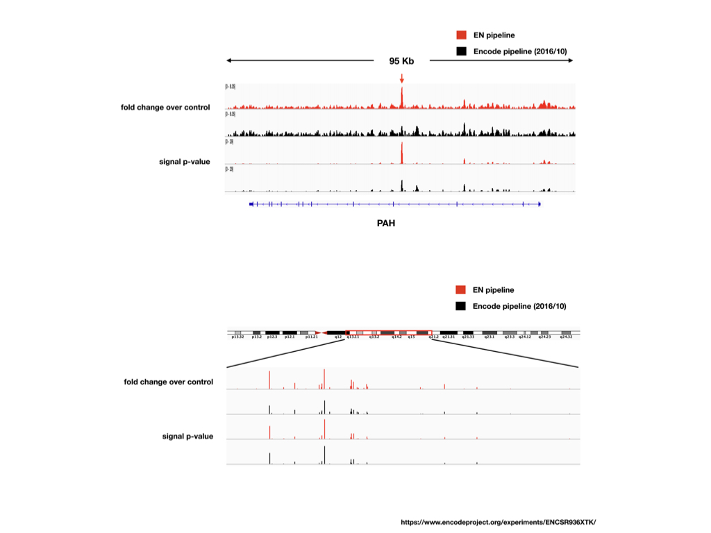

# ChIP-Seq Pipeline based on Encode
__Writen by Chunlei Yu__
 

## Introduction
 
This ChIP-seq data processing pipeline is based on the latest version of ENCODE Transcription Factor and Histone ChIP-Seq processing pipeline (1.2.2)(https://github.com/ENCODE-DCC/chip-seq-pipeline2), which is updated at 06/14/2019. The logics of inputs of the pipeline without changing the content of the pipeline. For more detail, see description/documentation from ENCODE. The pipeline has been tested and compared with human ChIP-Seq data (ENCSR936XTK) for the new version and older version (2016/10).
The performance of EN ChIP-seq outperforms the older version (Red Arrow).
 

